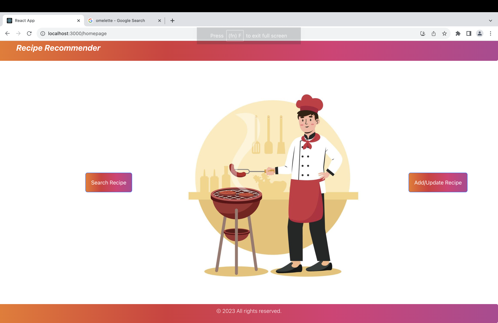
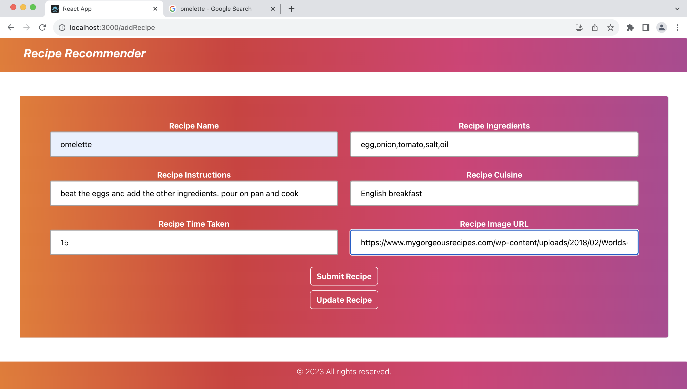
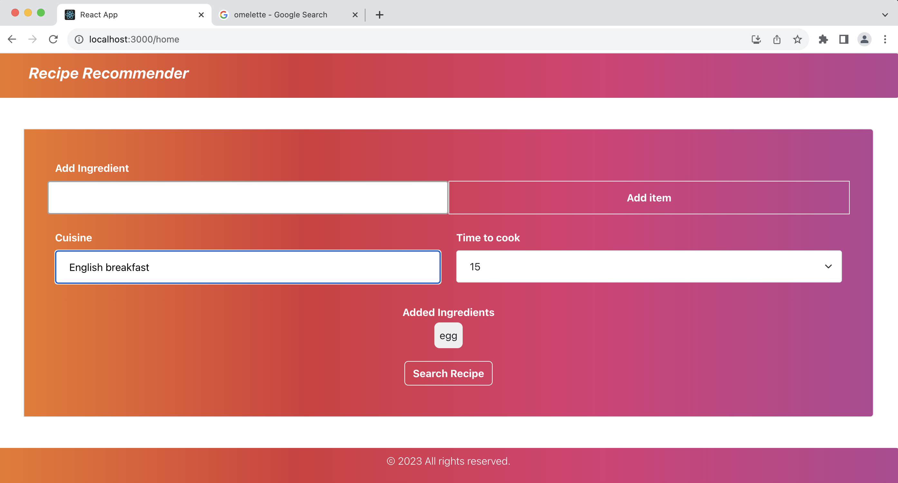

## Recipe Recommender


Recipe Recommender is an innovative application that simplifies the process of meal planning by suggesting recipes based on the ingredients you have readily available. Cooking can be a delightful experience, but deciding what to prepare with the ingredients on hand can be a daunting task. Our software is designed to alleviate this culinary challenge by offering a wide range of delectable recipes you can create using the ingredients in your kitchen.

[](https://opensource.org/licenses/MIT)
[](https://www.javascript.com/)
[](https://github.com/Fall-2023-SE-Group-14/Recipe_Recommender/issues)
[](https://badgen.net/github/stars/Fall-2023-SE-Group-14/Recipe_Recommender)

[](https://github.com/Fall-2023-SE-Group-14/Recipe_Recommender)
[](https://codecov.io/gh/Fall-2023-SE-Group-14/Recipe_Recommender)
[](https://github.com/Fall-2023-SE-Group-14/Recipe_Recommender/actions/workflows/Respost.yml)
[](https://github.com/Fall-2023-SE-Group-14/Recipe_Recommender/actions/workflows/codeFormatter.yml)

[](https://github.com/Fall-2023-SE-Group-14/Recipe_Recommender/actions/workflows/close_as_a_feature.yml)

## Project 2 Demo Video
[](https://www.youtube.com/watch?v=dcHxln0QEB4)


## Key Features

- **Ingredient-Based Recommendations:** Input the ingredients you have, and Recipe Recommender will provide you with a selection of recipes that match your available items.

- **Diverse Recipe Collection:** Explore a diverse collection of recipes ranging from quick and easy weekday meals to gourmet creations for special occasions.

- **Interactive and User-Friendly:** Our user-friendly interface makes it easy to find, save, and follow your favorite recipes.

- **Effortless Meal Planning:** Say goodbye to the hassle of meal planning and let Recipe Recommender inspire your culinary journey.

## How It Works

1. Input the ingredients you have on hand.
2. Browse through a curated list of recipes that match your available ingredients.
3. Select a recipe, view the ingredients and instructions, and start cooking.

Experience the joy of cooking with Recipe Recommender, and never wonder what to prepare for a meal again. Bon appétit!

## Tech Stack

       

## Software Requirements

- [Node.js v14.7.6](https://nodejs.org/en/download/)
- [NPM v6.14.15](https://nodejs.org/en/download/)

## Directory Structure

This is an overview of the directory structure of the project repository:

- **/Code**: Contains the main source code for the project.
- **/docs**: Documentation files, including READMEs, user manuals, API documentation, and SCORE CARD.
- **/frontend**: Contains the front end code for the project.
- **/backend**: Contains the backend code for the project.
- **/__tests__**: Unit tests, integration tests, and test-related code.
- **/config**: Configuration files for the project.
- **/adapter**: Adapter layer of the backend. Contains chatGPT integration.
- **/dao**: Contains the methods implemented for the various backend functionalities.
- **/dto**: Contains the models used in the project.
- **/handler**: Handler layer of the project. Contains the router files for the various modules.
- **/helpers**: Helper files.

- Code
   - backend
      - .env
      - .eslintrc.yml
      - .prettierignore
      - __tests__
         - spec.js
      - adapter
         - chatgpt.js
         - pexel.js
      - additionalTests
         - test1.js
         - test2.js
      - api
         - recipes.controller.js
         - recipes.route.js
         - userauth.route.js
         - userauth.service.js
      - config
         - keys.js
      - dao
         - recipes
            - addNewRecipe.js
            - getAllRecipe.js
            - getAutoComplete.js
            - getTotalRecipeCount.js
            - index.js
            - recipesDAO.js
            - updateRecipe.js
         - users
            - getUser.js
      - docs
         - swagger.yml
      - dto
         - recipe.js
         - users.js
      - handler
         - recipes
            - router.js
         - router.js
         - users
            - router.js
      - helpers
         - dbConnect.js
         - logger.js
         - mailParam.js
         - mailer.js
      - index.js
      - middleware
         - auth.js
      - package.json
      - server.js
      - service
         - recipe
            - index.js
      - tempusers.json
      - vercel.json
   - frontend
      - junit.xml
      - package.json
      - public
         - favicon.ico
         - index.html
         - logo192.png
         - logo512.png
         - manifest.json
      - src
         - App.css
         - App.js
         - App.test.js
         - Images
            - background-image.jpg
         - apis
            - recipeDB.js
            - youtube.js
         - components
            - AddRecipeForm.js
            - Footer.js
            - Form.js
            - Header.js
            - HomePage.js
            - Recipe.js
            - RecipeList.js
            - VideoURL.js
         - componentImages
            - bg-card.jpg
            - bg-card2.jpg
            - chef.png
            - chef1.png
         - login.css
         - login.js
         - index.css
         - index.js
         - logo.svg
         - reportWebVitals.js
         - setupTests.js
         - video.css
      - tailwind.config.js

## Setup Steps
**Installation**

1. Clone repository using "https://github.com/Fall-2023-SE-Group-14/Recipe_Recommender.git"
      ```
      git clone https://github.com/Fall-2023-SE-Group-14/Recipe_Recommender.git
      ```
2. Setup for frontend:

    open terminal and navigate to the **frontend** folder and execute the following:
      ```
      npm install
      ```
    Setup for backend:
        open terminal and navigate to the **backend** folder and execute the following:

      ```
      npm install
      ```
3. Create an Account in OpenAI API and get the chat GPT API token.(https://platform.openai.com/account/api-keys) Add it to env.

4. Create an Account in Pexel and get an API to generate Images for new recipes generated by the Chat GPT. (https://www.pexels.com/api/new/). Add it to env.


**Execution**
1. To start backend server
    ```
    npx nodemon
    ```
2. To start frontend server
    ```
    npm start
    ```
3. After this a window will open in the browser for login

## Modifications

1. User-friendly and improved UI
2. Added update feature to edit existing recipes.
3. Integrated chatGPT to fetch recipes for ingredients unavailable in the database.

## Modified UI




## Support
For any issues, contact recommenderrecipe@gmail.com
